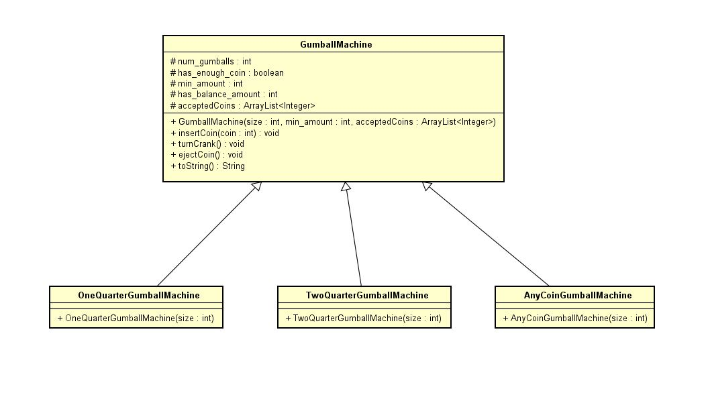

## Summary

In lab1, to support different machine models, we used separate derived classes with each providing common functionality for different configuration. The configuration like changing the cost of the gumball for machine etc requires a change in code. Here the configuration was tightly coupled to code.

The class diagram for the same is:

On the other hand,in case of FeatureIDE AspectJ, the configuration is handled separately in a config file (which is device.config file in this case), this provides a separation of concerns. The configuration can be changed to obtain the desired machine model. This way, the code is simpler and configurations are easily manageable.

## Output:

1. Gumball machine crank model accepts one quarter (Cost of gumball: 25 cents)

2. Gumball machine crank model accepts two quarters (Cost of gumball: 50 cents)

3. Gumball machine slot model accepts any coin (Cost of gumball: 50 cents)

4. Gumball machine slot model accepts any coin (Cost of gumball: 25 cents. Additional model, not in lab1)

